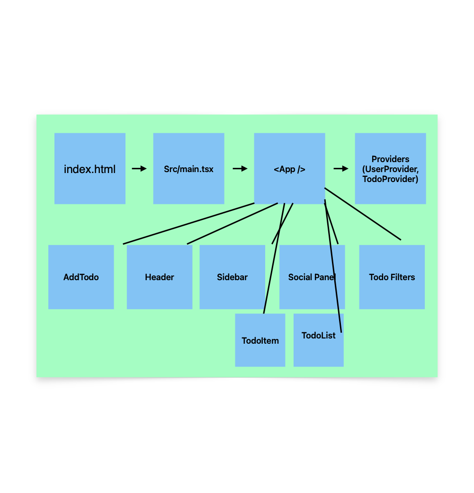

# Architechture Diagram

This Diagram shows a high level flow of the cool-todo v1 app.

- Entry: `index.html` → `src/main.tsx` → `<App />`
- Providers: `UserProvider`, `TodoProvider`
- Components: Header, Sidebar, SocialPanel, AddTodo, TodoList, TodoItem, TodoFilters

